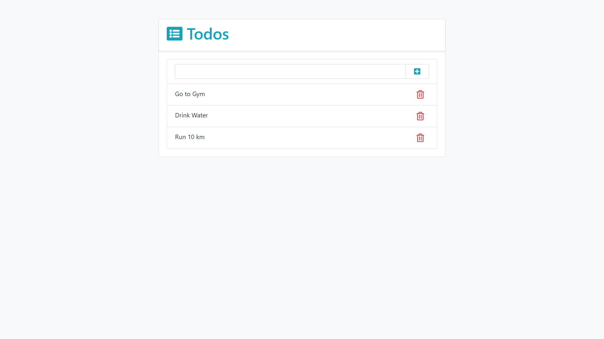

# Todo-App

This is a Todo app which stores the given task in a table when pressed on  icon and deletes certain task when pressed on .<br>
We used [](https://skills.thijs.gg)
_____
## Sample Image


## Prerequisists

Download and install Python and PostgreSQL<br>
Install django and psycopg2

```python
pip install django 
pip install psycopg2
```

After downloading the file from git.
Change the settings.py file according to your DB credentials

 
 Finally run the below command in cmd or powershell
 ```python
 python manage.py runserver
 ```
 After that copy the link and add /Todos/list at the end.<br>
 
 
  Example:
  
 ```html
 http://127.0.0.1:8000/Todos/list/
 ```
